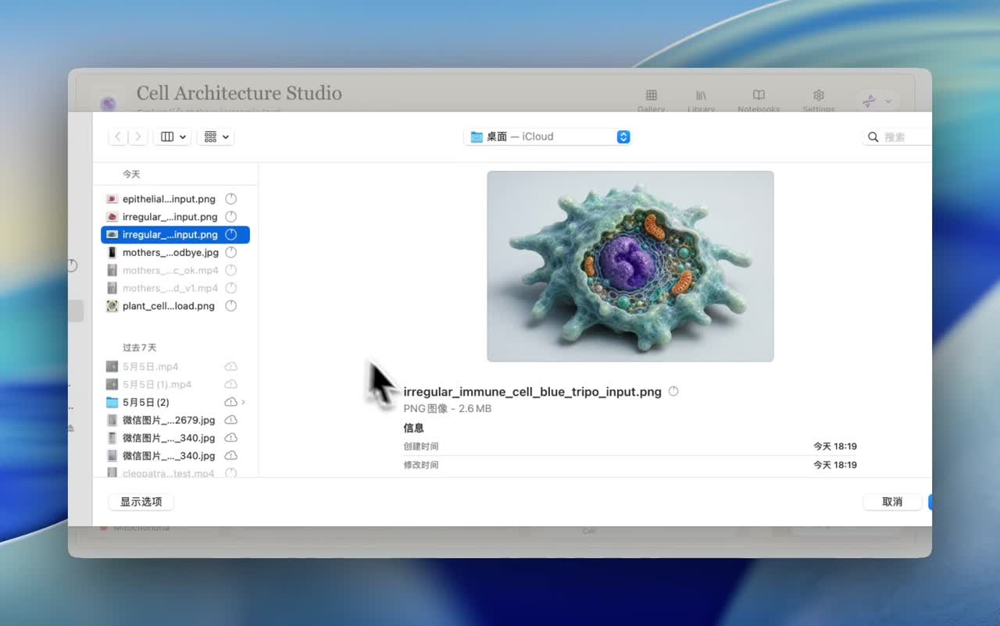

# 3DCellForge

[English](README.md) | [中文](README.zh-CN.md)

AI-powered interactive 3D cell generation and exploration studio.

3DCellForge is a React + Three.js prototype for exploring biological cell models in a polished browser UI. It supports live WebGL orbit controls, a left-cell / center-stage / right-tools workbench, screenshots, GLB export, collapsed upload history, demo presentation mode, a generation task center, and optional image-to-3D providers for generating real 3D models from uploaded reference images.

## Demo

[](docs/demo/3DCellForge-demo-2026-05-10.mp4)

Open the demo video: [3DCellForge-demo-2026-05-10.mp4](docs/demo/3DCellForge-demo-2026-05-10.mp4)

## Features

- Interactive cell viewer built with React Three Fiber.
- Three-column workbench: Cell Types on the left, WebGL stage in the center, microscope/generation tools on the right.
- Drag to rotate, scroll to zoom, isolate structures, inspect organelles, and export the current scene.
- Demo Mode for screenshots and screen recordings: hides side panels and keeps the model stage clean.
- Recent Uploads stays collapsed by default, with delete controls for custom generated/imported cells.
- Organelle detail drawer, microscope references, comparison panel, notes, gallery actions, and a compact generation task center.
- Hyper3D, Tripo, Fal.ai, Hunyuan3D, JS Depth, and Local GLB generation/import modes.
- Cached demo GLB models for offline-friendly screenshots and demos.
- Auxiliary Khronos glTF reference models for GLB loader and PBR material checks.
- API key stays server-side in `.env.local`; it is never exposed to the frontend bundle.

## Tech Stack

- React
- Vite
- Three.js
- React Three Fiber
- Drei
- Framer Motion
- Tripo API optional backend
- Fal.ai optional backend
- Hunyuan3D local API optional backend

## Quick Start

```bash
npm install
npm run dev
```

Open the Vite URL shown in the terminal.

## Workbench Workflow

The default screen is intentionally quiet:

- Pick official cells from the left `Cell Types` rail.
- Uploaded/generated/custom cells are tucked under `Recent Uploads` until expanded.
- Use the right `Microscope View` rail to choose the generation provider or import a local `.glb` / `.gltf`.
- Watch upload/generation/import state in the right `Generation Tasks` panel.
- Click `Info` or `Inspect` only when you need the organelle detail drawer.
- Click `Demo` in the top navigation to enter a clean presentation mode for screenshots and recordings.

Useful validation commands:

```bash
npm run lint
npm run build
npm run test
```

## Optional Image-to-3D Backend

To enable image-to-3D generation, create `.env.local`:

```bash
cp .env.example .env.local
```

Then set:

```bash
TRIPO_API_KEY=your_tripo_key
FAL_API_KEY=your_fal_key
RODIN_API_KEY=your_rodin_api_key
API_HOST=127.0.0.1
```

For Hunyuan3D local backup mode, start your local Hunyuan3D API server and set:

```bash
HUNYUAN_API_BASE=http://127.0.0.1:8081
HUNYUAN_CREATE_PATH=/send
HUNYUAN_STATUS_PATH=/status
```

The 3D generation backend supports these provider paths:

```text
Hyper3D  Hyper3D Rodin cloud generation only (default)
Tripo    Tripo cloud generation only
Fal      Fal.ai queue generation; model is selected in Settings
Auto     Hyper3D first, then Tripo, Fal, Hunyuan, and JS Depth backup
Hunyuan  Local Hunyuan3D generation only
```

The upload panel exposes the full generation mode choice before picking a file:

```text
Hyper3D     Hyper3D Rodin GLB generation
Tripo       Tripo cloud GLB generation
Fal         Fal.ai queue GLB generation
Hunyuan     Local Hunyuan3D GLB generation
JS Depth    Browser-side image relief with layered PNG fallback
Auto        Hyper3D, Tripo, Fal, Hunyuan, then JS Depth fallback
Local GLB   Import an existing .glb or self-contained .gltf
```

Tripo uploads use the current STS object-storage flow (`/upload/sts/token`) before creating an `image_to_model` task.
Fal uploads use the official `@fal-ai/client` storage and queue APIs. Supported Fal models are Hunyuan3D v2, TRELLIS, TripoSR, Tripo3D v2.5, and Hyper3D Rodin. Pick the active Fal model in `Settings`.
Rodin uploads use Hyper3D's multipart `/rodin` task API, then poll `/status` and cache the GLB returned by `/download`.
Generated GLBs are cached by the Node backend under `.generated-models/`, so later views use the local copy instead of temporary provider URLs.

You can also import a local `.glb` or self-contained `.gltf` from the Microscope View add button. Imported models become custom Cell Types and are served from the same local cache.

Expected Hunyuan3D local API shape:

```text
POST /send
GET  /status/:uid
```

The status response can return either a remote model URL or a base64 GLB field such as `model_base64` / `glb_base64`. Base64 GLBs are cached under `.generated-models/` and served by the Node backend.

Start the backend:

```bash
npm run dev:api
```

Then start the frontend:

```bash
npm run dev
```

The frontend talks to the local Node backend at `http://127.0.0.1:8787` by default.

## Demo Models

The repository includes cached generated GLB files under:

```text
public/generated-models/
```

These make the demo usable without spending API credits on every run.

## Reference Models

The Library panel includes remote Khronos glTF Sample Models as auxiliary references for material and loader checks:

- Transmission Test, CC0, Adobe via Khronos.
- Transmission Roughness Test, CC-BY 4.0, Ed Mackey / Analytical Graphics via Khronos.
- Mosquito In Amber, CC-BY 4.0, Loic Norgeot / Geoffrey Marchal / Sketchfab via Khronos.

These are loaded from the archived Khronos sample repository and are not bundled into this repo.

## Security

Do not put real API keys in frontend code. Keep secrets in `.env.local`, which is ignored by git.

## License

MIT
